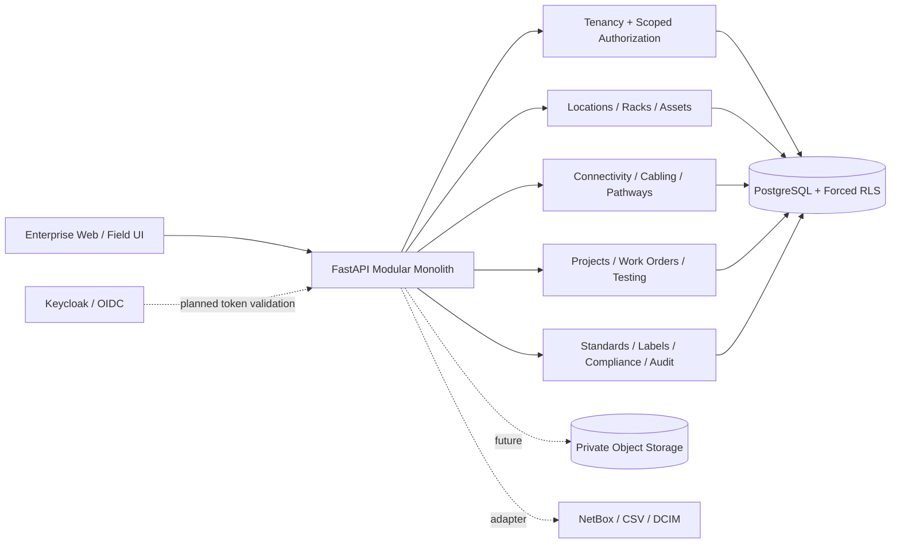

# 系统架构

## 决策摘要

采用 **Standalone domain model + NetBox adapter**，从模块化单体开始。核心物理连通关系保存在 PostgreSQL 关系模型中，追踪服务把端口、线缆终端和内部映射投影为图；不引入独立图数据库。

## 运行边界

- `apps/api/app/models.py`：规范化持久化模型
- `apps/api/app/services/`：业务规则与模块服务
- `apps/api/app/security.py`：主体、权限和授权范围
- `apps/api/app/db.py`：租户查询/写入保护和数据库会话
- `apps/api/app/main.py`：REST/API 组合根
- `apps/web/`：无前端运行时依赖的静态企业 UI 与原生 WebGL
- `migrations/`：模式与 PostgreSQL 安全策略

## 关键约束

1. 所有租户拥有对象带 `tenant_id`。
2. 唯一标识使用租户作用域约束。
3. SQLAlchemy 查询准则在应用层自动注入租户过滤。
4. `before_flush` 拒绝跨租户写入。
5. PostgreSQL 迁移对租户表启用并强制 RLS。
6. 平台操作使用独立 `BYPASSRLS` 数据库角色，普通应用角色不能绕过 RLS。
7. 审计事件在 ORM 和 PostgreSQL 触发器两层拒绝更新/删除。
8. 端口物理终端唯一，避免同一端口同时被两条线缆占用。

## 扩展路径

模块化单体保持事务一致性。只有在实际负载证据出现后，才考虑把搜索索引、文件处理、Webhook 交付或大型 3D 场景处理拆出为服务。
