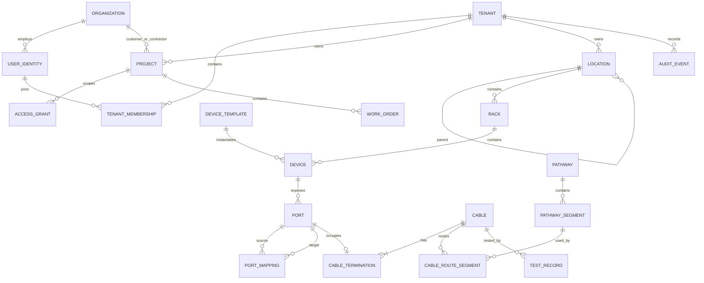

# 数据模型

## 核心 ERD

## 显式实体

- 平台与租户：`Organization`, `UserIdentity`, `Tenant`, `TenantMembership`, `AccessGrant`
- 项目：`Project`, `WorkOrder`, `TestRecord`
- 位置与资产：`Location`, `Rack`, `DeviceTemplate`, `Device`, `Port`, `PortMapping`
- 连通性：`Cable`, `CableTermination`, `Pathway`, `PathwaySegment`, `CableRouteSegment`
- 治理：`StandardProfile`, `Label`, `AuditEvent`

## 版本和历史

大多数租户对象包含 `version` 与时间戳，支持后续乐观并发和修订历史扩展。本纵向链路保留不可变审计事件，但尚未实现每个拓扑对象的完整有效时间历史表；这是 planned/as-built 全历史的后续硬化项。

## 当前未完整建模

- 多芯束、单根纤芯、纤对、熔接、托盘和 cassette 的完整层级
- `CableBundle` / `Harness` / breakout 关系
- 模块化设备槽位与子模块实例
- 文档附件对象及安全对象存储版本
- ChangeRequest、Task、Approval、InstallationRecord 的独立完整实体
