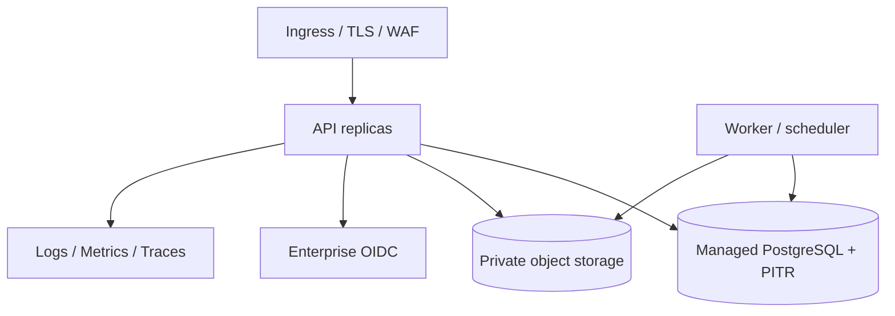

# 部署与运行

## 本地

`docker compose up --build` 设计为启动 PostgreSQL 17、Keycloak 26.3 和 API/UI。API 启动时执行 Alembic migration 和幂等 demo seed。

## 数据库角色

- `sim_app`：普通应用连接，受 forced RLS 约束
- `sim_platform`：迁移/平台控制面连接，显式 `BYPASSRLS`
- PostgreSQL 容器初始化脚本只用于开发；生产密码不能写入 SQL 或 Compose

## 生产拓扑建议

## 上线前门禁

- 真实 PostgreSQL forced-RLS 测试
- OIDC 集成和 MFA 策略
- 密钥管理、TLS 和网络策略
- 对象存储授权、扫描和生命周期
- migration rollback/restore 演练
- 数据库备份、PITR 和附件恢复
- Kubernetes probes、资源限制、PDB 和滚动升级
- OpenTelemetry、告警、审计留存
- 容量、负载和故障注入验证

当前环境没有 Docker/PostgreSQL 运行时，因此 Compose 只完成配置审查，未被本次交付标记为 100%运行实证。
