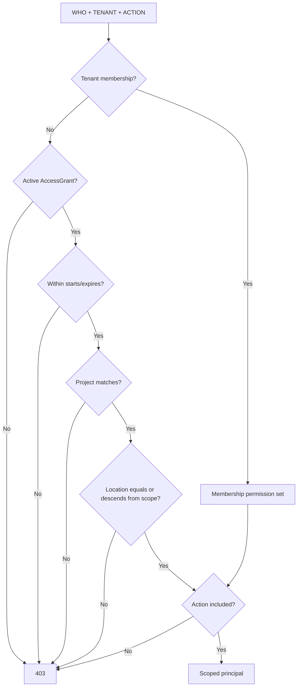

# 多租户与承包商授权

## 授权计算

## 防护层

| 层 | 防护 |
|---|---|
| API | 必需租户和主体上下文；资源操作调用权限检查 |
| Service | `require_permission` 和范围内资源读取 |
| ORM query | 自动追加 `tenant_id = current_tenant` |
| ORM write | flush 前拒绝跨租户对象 |
| PostgreSQL | 强制 RLS，`USING` 与 `WITH CHECK` 同时约束 |
| Platform | 单独 `sim_platform` 角色，显式 BYPASSRLS |
| Tests | Tenant A→Tenant B、跨租户写、承包商越界/过期等负向用例 |

## 承包商模型

Metro 技术员不成为 Northstar 租户成员。其 `AccessGrant` 同时绑定：

- 客户租户
- Engineering Building Upgrade Project
- Engineering Building/TR 位置子树
- 明确动作权限
- 起止时间
- 批准人和状态

撤销或过期后，主体解析失败。
